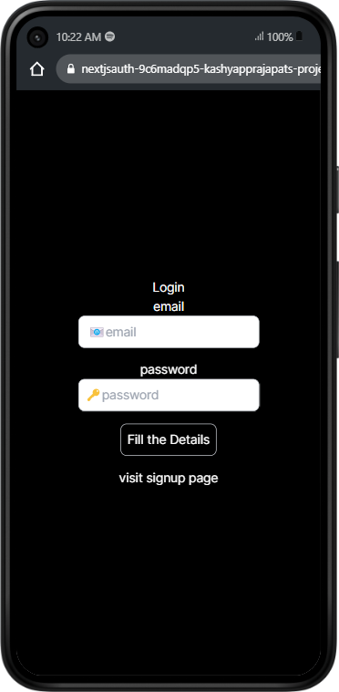
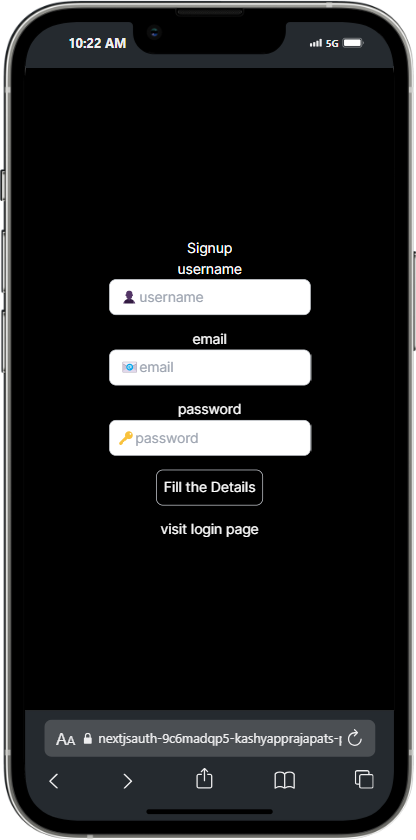
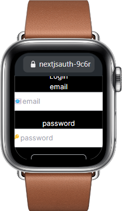

# NextAuthKing

## Table of Contents

1. [Introduction](#introduction)
2. [Features](#features)
3. [Live Demo](#live-demo)
4. [Prerequisites](#prerequisites)
5. [Installation](#installation)
6. [Configuration](#configuration)
7. [Usage](#usage)

## Live Link --  https://nextjsauth-one.vercel.app/login

## Introduction

NextAuthKing is a robust authentication solution built using Next.js. It provides a seamless and secure way to manage user authentication, featuring both traditional email/password login and OAuth integrations. With a focus on simplicity and performance, NextAuthKing aims to streamline the authentication process for developers and users alike.

## Features

- Secure email/password authentication
- OAuth integration (Google, Facebook, etc.)
- JWT token management
- Responsive design for different device views
- Easy configuration and customization

## Live Demo

### Laptop View

**Login Page**


**Profile Page**


### Mobile View

**Login View**


**Sign Up View**


### Watch View

**Watch View**


## Prerequisites

- Node.js (v14 or higher)
- npm or yarn

## Installation

1. Clone the repository:
   ```bash
   git clone https://github.com/kashyapprajapat/nextjsauth.git

2. Navigate to the project directory:
     cd nextjsauth

3.install dependancy
   npm install
   or 
   yarn install

4. craete env file and add value according to that
   MONGODB_URL= 
   NODEMAILER_EMAIL = 
   NODEMAILER_PASSWORD = 
   TOKEN_SECRET=
   DOMAIN=

5.Run Project
   npm run dev
